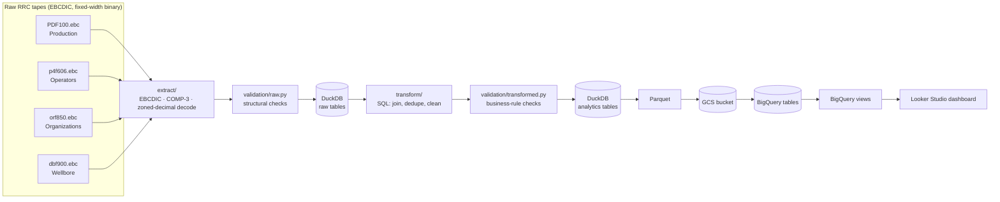

# Texas Oil Data Platform

[](https://github.com/Shavril/texas-oil-data-platform/actions/workflows/tests.yml)
[](LICENSE)

A production-shaped data engineering pipeline that turns Texas Railroad Commission (RRC) legacy mainframe tape extracts — EBCDIC-encoded, packed-decimal, fixed-width binary files with no public parsing library — into validated, queryable analytics tables and a BigQuery-backed dashboard.

This is a portfolio project. The goal isn't just "make a chart from a CSV" — it's to demonstrate the parts of data engineering that are actually hard: parsing an undocumented legacy binary format correctly, catching data-quality problems that only show up at full scale, and building a pipeline that's tested, validated, configured, and orchestrated the way a real one would be.

## What this demonstrates

- **Reverse-engineered legacy binary formats from scratch.** Four RRC mainframe tape formats — EBCDIC text, IBM COMP-3 packed decimal, and signed zoned-decimal with trailing-overpunch sign — decoded with hand-written byte-level parsers (`src/oil_pipeline/utils.py`), no third-party mainframe library. Every field position and encoding is documented per-file in [`docs/`](docs/), derived from the RRC's own format spec PDFs and cross-checked against full-file scans of the real data.
- **A tiered data-validation framework, not just `assert`.** [`src/oil_pipeline/validation/`](src/oil_pipeline/validation) uses [pandera](https://pandera.readthedocs.io) schemas with two severities in the same schema: structural violations (bad types, broken keys, violated grain assumptions) raise and halt the pipeline; known data-quality quirks (undocumented status codes, blank optional fields) log a warning and let the run continue. See [Data quality findings](#data-quality-findings-from-real-data) below for what this actually caught.
- **Orchestrated with Dagster**, one asset per pipeline step, with a real production bug found and fixed along the way (Dagster's default multiprocess executor deadlocks on Windows for this pipeline — fixed by pinning `in_process_executor`, verified empirically rather than assumed).
- **Validated against the real files, not just samples.** The four source tapes total ~11 GB. Several issues below were invisible on a quick smoke test and only surfaced by running the full pipeline against full-size production data.
- **81 automated tests** across every layer — binary parsers (via hand-built synthetic EBCDIC/COMP-3 records, no real data files needed), SQL transforms (against an in-memory-style DuckDB), validation schemas, and config — running in CI on every push.
- **No hardcoded config.** Every path, GCP project, bucket, and dataset name is a required setting (`src/oil_pipeline/config.py`, pydantic-settings), sourced from environment variables or a local `.env` — nothing to edit in source to point this at a different environment.

## Architecture



Everything from `extract/` through `BigQuery views` runs as a [Dagster](https://dagster.io) asset graph ([`src/oil_pipeline/dagster_defs/`](src/oil_pipeline/dagster_defs)) — one asset per pipeline step, dependencies matching the real data lineage (e.g. each BigQuery view asset depends only on the specific upstream tables its own SQL joins, not a blanket dependency on everything). Views get their own job (`analytics_views_job`), separate from the routine data-refresh job (`all_assets_job`): a BigQuery view is a saved query evaluated fresh at query time, not a materialized snapshot, so it only needs to be (re-)created when its SQL changes, not on every data refresh.

`main.py` is a second, plain-script entry point that calls the exact same Dagster asset functions directly (Dagster supports invoking `@asset`-decorated functions as plain Python) — so there is exactly one copy of the pipeline logic, not two, regardless of which entry point you run.

## Data sources

All four datasets are full extracts from the Texas Railroad Commission, each documented field-by-field in [`docs/`](docs/):

| Dataset | Source file | Size | Records | Format |
|---|---|---|---|---|
| Statewide oil production | `PDF100.ebc` | 1.1 GB | 10,787,639 (165,436 leases) | Nested fixed-width segments, EBCDIC + COMP-3 |
| P-4 operator/lease | `p4f606.ebc` | 2.8 GB | 30,303,110 (548,100 root records) | Nested fixed-width segments, EBCDIC |
| P-5 organizations | `orf850.ebc` | 214 MB | 611,104 (74,947 orgs) | Fixed-width segments, EBCDIC |
| Wellbore database | `dbf900.ebc` | 7.4 GB | 29,823,101 (1,211,829 wells) | Flat fixed-width segments, EBCDIC + COMP-3 + zoned decimal |

Raw files aren't redistributable and aren't committed (see `data/raw/` in `.gitignore`) — this repo ships the parsers and the documentation of what they expect, not the data itself.

## Data quality findings, from real data

Testing against synthetic records catches logic bugs. Running the full pipeline against all ~11 GB of real source data caught things no unit test would:

- **A validation library/database dtype mismatch that would have hard-failed every run.** DuckDB's `.fetchdf()` returns plain `object`-dtype Python strings, but pandera's `str` type check (in this pandas/pandera combination) expects the newer `string[pyarrow]` dtype — a false-positive structural failure on every transformed table. Fixed with targeted `coerce=True`, caught before it ever reached production because the pipeline was dry-run against real files, not just mocked.
- **A silent pandas/DuckDB type-inference gap.** An empty DataFrame with no explicit dtype gives DuckDB nothing to infer a column type from, so it defaults to `INTEGER` — broke a `COALESCE` between an `INTEGER` and a `VARCHAR` column in the wells transform, but only under empty test fixtures, not real data. Fixed by giving synthetic empty fixtures an explicit pandas `"string"` dtype.
- **A real, if rare, data-entry quirk in the wellbore file.** 37 of 1,211,829 well records have `total_depth` right-justified/space-padded (`"    0"`) instead of zero-padded like the rest — an assumption my structural check got wrong, caught only by validating the full file. DuckDB's own `CAST` already tolerates the padding; the validation check was tightened to match.
- **An exact duplicate record in the P-4 operator tape.** Confirmed by pulling the raw bytes directly: two root records, byte-for-byte identical, same operator number — a genuine tape artifact, not a decode bug. Handled with the same defensive-dedupe pattern already used for the wellbore file's recurring completion records, so the `lease_operators` table's documented one-row-per-lease grain holds regardless.

## Tech stack

| Layer | Tool |
|---|---|
| Language / tooling | Python 3.13, [uv](https://docs.astral.sh/uv/) |
| Local processing & storage | pandas, [DuckDB](https://duckdb.org), Parquet |
| Data validation | [pandera](https://pandera.readthedocs.io) |
| Orchestration | [Dagster](https://dagster.io) |
| Configuration | [pydantic-settings](https://docs.pydantic.dev/latest/concepts/pydantic_settings/) (env-driven, no defaults) |
| Cloud warehouse | Google Cloud Storage, BigQuery |
| Dashboarding | Looker Studio |
| Testing / CI | pytest, GitHub Actions |

## Repository structure

```
texas-oil-data-platform/
├── data/
│   ├── raw/            # gitignored — RRC source tapes
│   ├── database/       # gitignored — analytics.duckdb
│   └── processed/      # gitignored — Parquet exports
├── docs/                # field-by-field data dictionary, one per source file
├── notebooks/            # exploratory analysis, one per dataset
├── src/oil_pipeline/
│   ├── utils.py           # EBCDIC / COMP-3 / zoned-decimal decode primitives
│   ├── extract/            # one parser per tape format
│   ├── transform/           # SQL: analytics tables + BigQuery view definitions
│   ├── load/                  # DuckDB / Parquet / GCS / BigQuery writers
│   ├── validation/             # pandera schemas, raw (structural) + transformed (business-rule)
│   ├── dagster_defs/            # Dagster assets, jobs, Definitions
│   └── config.py                 # pydantic-settings: every setting required, none hardcoded
├── tests/                # 81 tests: parsers, transforms, validation, config
├── main.py                # plain-script entry point (same assets as Dagster)
├── definitions.py          # Dagster entry point (`dagster dev`)
└── .github/workflows/        # CI: full test suite on every push/PR
```

## Running it

```bash
# 1. Install dependencies
uv sync

# 2. Configure — every setting is required, none hardcoded (see config.py)
cp .env.example .env
# edit .env: raw data paths, GCP project/bucket/dataset

# 3a. Run via Dagster (asset graph, manual or scheduled materialization)
uv run dagster dev
# open http://localhost:3000

# 3b. ...or run the whole pipeline as a plain script
uv run python main.py

# 4. Run the tests
uv run pytest
```

## Status / roadmap

Raw data discovery, EBCDIC/COMP-3 decoding, validation, transformation, orchestration, BigQuery warehouse, Looker Studio dashboard, testing, and CI are all in place. Not yet done: containerization (Docker), infrastructure as code (Terraform), and a formal star schema for the warehouse layer.

## License

[GNU GPLv3](LICENSE)
